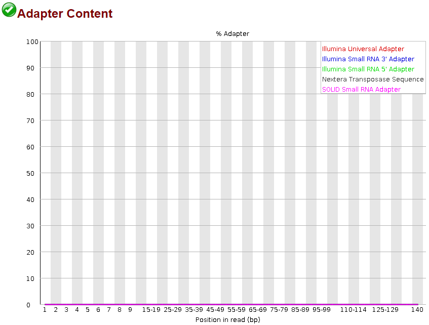

# Analysis of Gene Expression Following Environmental Stressors

Next generation sequencing has provided opportunities to understand the molecular and genomic consequences of climate change induced environmental stressors on organisms. Specifically, RNA-seq has enabled us to understand what genes are being up- or down-regulated in response to these stressors. By analyzing gene expression data, we have a much greater understanding of the physiological consequences that have been previously described in many model species. 


# Project Objectives

We developed the `~/RNASeq_Data/spring-cleaning.sh` script in this repository to perform quality control measures of RNA-seq data that was sequenced with Illumina methods. In addition, `spring-cleaning.sh` aligns trimmed RNA-seq reads to a reference genome that was obtained via NCBI. 

This script is only the beginning of many that it takes to fully analyze and publish RNA-seq data. The [**Future Directions**](#Future-Directions) section outlines the programs and suggested statistics that can be used to understand the differential gene expression between treatments. 

Total RNA was extracted from the common mouse species, *Mus musculus*, that was exposed to two separate treatment groups. We thank these mice for their service and dedication to the advancement of our scripting skills. 


# Script Functions

Prior to data analysis, it is useful to understand what the purpose of each function will be. Here, I will outline the objective of each function that is implemented in `spring-cleaning.sh` and the input files required. The next section will also highlight all output files generated in each function. 


***quality_check***
The `quality_check` function utilizes the module *FastQC* to perform quality assessments of raw RNA-seq data. An example of output from *FastQC* is utilized below. 
* Input files : raw .fastqc.gz sequencing files


***trim_reads***
The `trim_reads` function uses the *TrimGalore* module to improve the quality of reads by removing contamination from adapter sequences on the 3' end. *TrimGalore* automatically detects the sequence of the adapter used unless the user specifies otherwise. 
* Input files : raw .fastqc.gz files

|    |   |
|:--------:|:---:|
| **Before Trimming** | **After Trimming** |


***qc_trimmed***
`qc_trimmed` uses the *FastQC* module identical to the `quality_check` function, but with the trimmed RNA-seq files. This allows confidence in the performance of `trim_reads`. 
* Input files : val_1.fq.gz files that were generated by the *trim_reads* function

***mapping***
The `mapping` function includes two steps: 1) Indexing the reference genome, and 2) Mapping RNA-seq reads to the indexed reference genome. The genome must be indexed before mapping it to reads as it makes the alignment process much more efficient, similar to reading a book.
* Input files : .fasta genome file (must be unzipped)
  * .gtf genome transcripts file (must be unzipped)
  * val_1.fq.gz files that were generated by the *trim_reads* function

After mapping reads to the reference genome, we can continue analyzing the differentially expressed genes contained in the RNA-seq data. 


## All Output Files

Throughout these scripts, many output files are generated by used of several programs. The following section contains descriptions of what will be contained in each of these files. Bolded filenames are important contributors to further analyses. 

###### FastQC (Fast Quality Checks)
* **FILENAME_fastqc.html** : Contains all quality check information. Having good read quality is essential prior to further analysis.
* FILENAME_fastqc.zip : a compress version of the .html file 

###### TrimGalore
* SAMPLENAME_filtered_R1.fastq.gz_trimming_report.txt : provides summary of read statistics from each file. 
* **SAMPLENAME_filtered_R1_val_1.fq.gz** : trimmed reads file that can be mapped to reference

###### STAR (Spliced Transcripts Alignement to a Reference)
* **Aligned.out.sam** : Alignments to the genome in standard SAM format.
* **Log.out** : Main log file with a lot of detailed information about the run. This file is most useful for troubleshooting and debugging.
* **Log.progress.out** : Reports job progress statistics, such as the number of processed reads, % of mapped reads etc.
* **Log.final.out** :  Summary mapping statistics after mapping job is complete, very useful for quality control. The statistics are calculated for each read (single- or paired-end) and then summed or averaged over all reads.
* **ReadsPerGene.out.tab** : 4 columns - 1) gene ID, 2) counts for unstranded RNA-seq, 3) counts for the 1st read strand aligned with RNA, 4) counts for the 2nd read strand aligned with RNA.
* SJ.out.tab : Contains high confidence collapsed splice junctions in tab-delimited format. 
* chrLength.txt : 1 column - length in base pairs of each chromosome
* chrNameLength.txt : 2 columns - 1) chromosome name and 2) chromosome length
* **chrName.txt** : 1 column - chromosome names. After indexing the genome, you can change the chromosome names in this file while keeping the same order. The names in this file will be used in all output alignment files (i.e. Alignment.out.sam).
* chrStart.txt : 1 column - starting point of each chromosome in order
* exonGeTrInfo.tab : position of exons (based on transcript file [.gtf])
* exonInfo.tab : length of exons
* geneInfo.tab : empty
* **Genome** : Comprise binary genome sequence, suffix arrays, text chromosome names/lengths, splice junctions coordinates, and transcripts/genes information. Most of these files use internal STAR format and are not intended to be utilized by the end user.
* genomeParameters.txt : User input parameters for STAR to run, including defaults
* **SA** : Suffix Array (a sorted array of all suffixes of a string)
* **SAindex** : Indexed representation of Genome
* sjdbInfo.txt : transcript length (set by user, based on sequencing adapters, Illumina is 99)
* sjdbList.fromGTF.out.tab : empty
* sjdbList.out.tab : empty
* transctiptInfo.tab : all transcripts 

# Future Directions

After aligning RNA-seq data to a reference genome or transcriptome and obtaining the counts per gene (i.e. `spring-cleaning.sh`), you are able to analyze these data for differential gene expression. The **ReadsPerGene.out.tab** file that was generated by STAR can be imported into RStudio and then filtered to remove genes that had low read counts. 

The genes that are highly expressed can then be passed through *DESeq2*, a program to analyze differential gene expression between treatment groups. Yalamanchili et al. (2019) provides descriptive documentation on these analyses, and the code outlined in this section was modified from their manuscript published in *Current Protocols in Bioinformatics*. This code can be further adapted to analyze any other RNA-seq dataset. 

###### Create data objects:

```
sample.names <- sort(paste(c(“CASE”, “CONTROL”), rep(1:3, each=2), sep=““))

file.names <- paste(“../”, sample.names, “/”, sample.names, “.count.txt”,sep=““)

conditions <- factor(c(rep(“CASE”, 3), rep(“CONTROL”, 3)))

sampleTable <- data.frame(sampleName=sample.names, fileName=file.names, condition=conditions)

ddsGENECOUNT <- DESeqDataSetFromGeneCount(sampleTable=sampleTable, directory=“.”, design=~ condition )
```

This step tells R the sample identifiers, names of files with gene counts, and experiment conditions for each sample.


###### Run differential gene analysis:

```
ddsGENECOUNT <- ddsGENECOUNT[rowSums(counts(ddsGENECOUNT)) > 10, ]

dds <-DESeq(ddsGENECOUNT)
```

###### Quality checks on the samples with a PCA plot and heatmap:

```
rld <- rlogTransformation(dds, blind=FALSE)

plotPCA(rld, intgroup=“condition”, ntop=nrow(counts(ddsGENECOUNT)))

cU <-cor( as.matrix(assay(rld)))

cols <- c( “dodgerblue3”, “firebrick3” )[condition]

heatmap.2(cU, symm=TRUE, col= colorRampPalette(c(“darkblue”,”white”)) (100), labCol=colnames(cU), labRow=colnames(cU), distfun=function(c) as.dist(1 - c), trace=“none”, Colv=TRUE, cexRow=0.9, cexCol=0.9, key=F, font=2, RowSideColors=cols, ColSideColors=cols)
```

Draw PCA plot and correlation heatmap to visualize if the samples cluster per their conditions. In cases where samples do cluster in groups but the grouping is not the experimental conditions or genotypes, it indicates that the samples are clustered by other factors.


# Box Folder
Here is the link to the Box Folder with our data: https://auburn.box.com/s/x17154cah63h3yp4wd14ak6p0fa3t5jz
